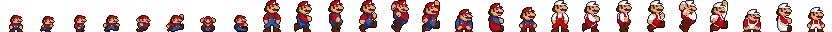
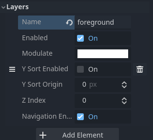

# NAPRAVI SUPER MARIA


## Godot engine


- Besplatni open source game development engine
- Programski jezici:
    - **GDScript**
    - C#
    - C++
    - Rust
    - ...
- Mogucnost razvoja **2D** i 3D igara
- Razvoj se temelji na scenama i cvorovima
    - Svaka komponenta na zaslonu moze biti odvojena scena

- Postavke igre:
    - Rezolucija: 800x600
    - Skaliranje (_Scale_): 2

## It's me Mario

- Dostupni su razni cvorove za izradu likova
    - Mi koristimo _CharacterBody2D_

- Mario mora imati izgledati kao Super Mario
    - Dodati _Sprite2D_ na naseg Maria

_Dobro sto smo mi to sada dodali?_

- [_CharacterBody2D_](https://docs.godotengine.org/en/stable/classes/class_characterbody2d.html) je specijalizirani objekt u Godot engine-u za izradu fizickih tijela koja mogu biti upravljana
    - u 3D svijetu mozemo koristiti 3D verziju ovakvoga objekta (_CharacterBody3D_)

- [Sprite2D](https://docs.godotengine.org/en/stable/classes/class_sprite2d.html) je cvor za prikazivanje 2D tekstura
    - Moze biti:
        - Odredeni frame iz niza animacija
    
        
	- Odredeno podrucje iz atlasa fotografija\
    

_Ali dobro, sto je to uopce tekstura?_

- Za nas je to samo slika koja prikazuje elemente u videoigri 
    - u 3D svijetu, teksture koristimo na modelima da bi im dali zeljeni izgled (3D svijetu trebaju modeli! - uglavnom)

- Unutar Inspectora s desne strane prilikom selektiranog _Sprite2D_ cvora podesiti sljedece:
    - HFrames: 26
    - VFrames: 1
    - Frame: 0
    - Frame coords: x=0, y=0

I opet: IT'S ME MARIO!

## Izrada levela


- [_TileMap_](https://docs.godotengine.org/en/stable/tutorials/2d/using_tilemaps.html) - mreza plocica koje mozemo dodavati na zaslon
    - Puno bolje nego puno _Sprite2D_

- Dodamo ga unutar _World_ cvora
    - Kreiramo novi _TileSet_ unutar inspektora
    - Unutar donjeg izbornika dodamo nase plocice


- _TileMap_ layeri - mozemo definirati razlicite layere gdje zelimo crtati nas level
    - Definirajmo _foreground_ i _background_\


- Mozemo definirati i razlicite uzorke (npr. cijev)

**Nacrtajmo level!**

## Detekcija sudara

- Kako detektirati sudare izmedu objekata na sceni?
- Sudari se provjeravaju svaki frame
    - Uglavnom su integrirani u engine
- Optimizacijski, jedna od najtezih stvari u razvoju igara/enginea


> Oblici za detekciju sudara


> Detekcija sudara


> Detekcija sudara na kompleksnoj sceni

- Na nama je uglavnom da definiramo odziv na sudar:
    - _is\_on\_floor_
    - _is\_on\_wall_
    - _get\_slide\_collision_
    - ...

### Dodajmo oblike za detekciju sudara
- _Mario_ -> _CollisionShape2D_ -> _Shape_ (unutar inspektora) -> _CircleShape2D_
- _TileMap_ -> _TileSet_ (unutar inspektora) -> _Physics Layer_ -> _Add element_


### Collision Layer i Collision Mask
- Collision Layer definira u kojem layeru se mi nalazimo
- Collision Mask definira layere sa kojim cemo detektirati sudar

## Skritpiranje/programiranje

- Skriptama opisujemo ponasanje odredenog cvora na sceni
- Neka se nas Mario krece!
    - Desni klik na _Mario_ cvor
    - _Attach script_
    - _Load_

- Kod koji dobijemo s dodatnim komentarima:

```gdscript
extends CharacterBody2D

# konstana brzina kretanja
const SPEED = 300.0
# konstantana snaga skoka
const JUMP_VELOCITY = -400.0

# Gravitacija definirana u postavkama projekta
var gravity = ProjectSettings.get_setting("physics/2d/default_gravity")

# Funkcija za racunanje fizike
func _physics_process(delta):
	# Dodaj gravitaciju na kretanje
	if not is_on_floor():
		velocity.y += gravity * delta

	# SKOK!
	if Input.is_action_just_pressed("ui_accept") and is_on_floor():
		velocity.y = JUMP_VELOCITY

	# Odredi smjer kretanja sukladno pritiskom tipki na tipkovnici
	var direction = Input.get_axis("ui_left", "ui_right")
	if direction:
        # Prilagodi brzinu kretanja sukladno smjeru
		velocity.x = direction * SPEED
	else:
		velocity.x = move_toward(velocity.x, 0, SPEED)
    # Umjesto racunanja tocnih pozicija pozivamo ovu funkciju
	move_and_slide()
```

### Dodavanje korisnickih inputa
- _Project_ -> _Project Settings_ -> _Input Map_ -> _Add New Action_ (dva puta)
- Jedan input - _left_ - "A"
- Drugi input - _right_ - "D"

- Mogucnost dodavanja niza korisnickih inputa

### Kod koji nam zapravo treba

```gdscript
extends CharacterBody2D

# Export opcije su one koje mozemo uredivati iz inspektora cvorova
@export var SPEED : float = 100.0
@export var JUMP_VELOCITY : float = -300.0
@export var MAX_SPRINT : int = 2

# Get the gravity from the project settings to be synced with RigidBody nodes.
var gravity : float = ProjectSettings.get_setting("physics/2d/default_gravity")

func _physics_process(delta) -> void:
	# Add the gravity.
	if not is_on_floor():
		velocity.y += gravity * delta
	# Handle jump.
	if Input.is_action_just_pressed("ui_accept") and is_on_floor():
		velocity.y = JUMP_VELOCITY
	var direction = Input.get_axis("left", "right")
	if direction:
		velocity.x = direction * SPEED
	else:
		velocity.x = move_toward(velocity.x, 0, SPEED)
		
	if direction:
        # Flipni Maria po promjeni smjera kretanja
		$MarioAsset.flip_h = (direction == -1)
	move_and_slide()
```

_Pa dobro kakve su sad to cudne rijeci int, float, void?_

### Staticko vs Dinamicko programiranje

- Varijable su pridruzene tipu podataka koje su im definirane


[Tipovi podataka u Godot Engineu](https://docs.godotengine.org/en/stable/tutorials/scripting/gdscript/gdscript_basics.html#built-in-types)

[Staticko programiranje u Godot Engineu](https://docs.godotengine.org/en/stable/tutorials/scripting/gdscript/static_typing.html)


## Animacije

- U 2D svijetu nizovi slicica koje se izmjenjuju u odredenom vremenu
    - U 3D svijetu, isto to samo kompliciranije


- Dodamo _AnimationPlayer_ na naseg Maria
- U donjem izborniku odaberemo _Animation_ ako vec nije odabrano
- Zatim unutar tog prozora ponovno odaberemo _Animation_ 

    - Nakon toga _New Animation_
    - Nazovimo ju _idle_
    - Postavimo joj vrijeme trajanja na 0.001 na desnoj strani vremenske trake
    
    
- Odaberemo _Sprite2D_ iz _Mario_ cvora:
    - Unutar inspektora s desne strane kliknemo na kljucic kraj _Frame_ opcije

    - Dodajmo novu _walk_ animaciju:
        - Vrijeme trajanja animacije: 0.2
        - Prvi frame u trenutku 0 sa _Frame_ = 0
        - Drugi frame u trenutku 0.1 sa _Frame_ = 3
    - Dodajmo trecu _jump_ animaciju:
        - Vrijeme trajanja animacije: 0.5
        - Prvi frame u trenutku 0 sa _Frame_ = 0
        - Drugi frame u trenutku 0.1 sa _Frame_ = 5

### Promjena animacija unutar koda
- Postoji nekoliko nacina za promjenu animacija, no mi cemo ih izmjenjivati unutar koda:

```gdscript
extends CharacterBody2D

@export var SPEED : float = 100.0
@export var JUMP_VELOCITY : float = -300.0
@export var MAX_SPRINT : int = 2
var sprint_multiplier : float = 1

# Get the gravity from the project settings to be synced with RigidBody nodes.
var gravity : float = ProjectSettings.get_setting("physics/2d/default_gravity")

# Skoro isto kao i prije
func _physics_process(delta) -> void:
	# Add the gravity.
	if not is_on_floor():
		velocity.y += gravity * delta
	# Handle jump.
	if Input.is_action_just_pressed("ui_accept") and is_on_floor():
		velocity.y = JUMP_VELOCITY
	
	if Input.is_action_pressed("sprint"):
		if $Timer.is_stopped():
			$Timer.start()
	
	if Input.is_action_just_released("sprint"):
		sprint_multiplier = 1
		$Timer.stop()

	var direction = Input.get_axis("left", "right")
	if direction:
		velocity.x = direction * SPEED * sprint_multiplier
	else:
		velocity.x = move_toward(velocity.x, 0, SPEED)
		
	if direction:
		$MarioAsset.flip_h = (direction == -1)
	
	_update_animations(direction)

	move_and_slide()

# Nova funkcija za izmjenu animacija
func _update_animations(direction : int) -> void:
    # Ako nisam na podu znaci da skacem
	if not is_on_floor():
		$AnimationPlayer.play("jump")
		return
    # Ako se krecem znaci da hodam
	if direction != 0:
		$AnimationPlayer.play("walk")
		return
    # Samo stojim!
	$AnimationPlayer.play("idle")
```
- Svaka animacija je jedno stanje (_StateMachine_?)\


## Mario moze i brzo trcati

- _Mario_ postepeno ubrzava dok ne dostigne maksimalnu brzinu

_Pa dobro kako cu ja napraviti da on postepeno ubrzava?_

- Dodamo novu input akciju na pritisak _CTRL_ i nazovimo ju _sprint_
- Dodajmo _Timer_ nasem Mariu
    - _Wait Time_ = 0.2s

### Game event loop


### Signali i odzivi


- Odzivi na signale se implementiraju u Slotovima\


### Timeout signal

- Dodajmo _Timeout_ signal nasem novom _Timeru_


- Unutar te funkcije implementirajmo logiku naseg trcanja

```gdscript
@export var SPEED : float = 100.0
@export var JUMP_VELOCITY : float = -300.0
@export var MAX_SPRINT : int = 2
var sprint_multiplier : float = 1

...

func _on_timer_timeout():
	if sprint_multiplier < MAX_SPRINT:
		sprint_multiplier += 0.3
	$Timer.start()
```

_Hmm nesto jos fali..._

- Procesirajmo nase trcanje na pritisak tipke:

``` gdscript
func _physics_process(delta) -> void:
	# Add the gravity.
	if not is_on_floor():
		velocity.y += gravity * delta
	# Handle jump.
	if Input.is_action_just_pressed("ui_accept") and is_on_floor():
		velocity.y = JUMP_VELOCITY
	
	if Input.is_action_pressed("sprint"):
		if $Timer.is_stopped():
			$Timer.start()
	
	if Input.is_action_just_released("sprint"):
		sprint_multiplier = 1
		$Timer.stop()

	var direction = Input.get_axis("left", "right")
	if direction:
		velocity.x = direction * SPEED * sprint_multiplier
	else:
		velocity.x = move_toward(velocity.x, 0, SPEED)
		
	if direction:
		$MarioAsset.flip_h = (direction == -1)
	
	_update_animations(direction)

	move_and_slide()
```

_A dobro, ovo izgleda bas lose, sto je s animacijama?_

- S obzirom da Mario samo ubrza, mi mozemo isto mozemo samo ubrzati animaciju:

```gdscript
func _update_animations(direction : int) -> void:
	if not is_on_floor():
		$AnimationPlayer.play("jump")
		return
	if direction != 0:
            # ako je sprint_mutliplier > 1 znaci da trcimo
		if sprint_multiplier > 1:
                        # speed_scale parametar odreduje koliko ce se brzo animacija izvoditi
			if $AnimationPlayer.speed_scale < 3:
				$AnimationPlayer.speed_scale = $AnimationPlayer.speed_scale * sprint_multiplier
		else:
			$AnimationPlayer.speed_scale = sprint_multiplier
			$AnimationPlayer.play("walk")
		return
        # ako vise ne trcimo vratimo sprint_multplier na pocetnu vrijednost
	sprint_multiplier = 1
	$AnimationPlayer.play("idle")
```

**SKORO PA JE DOBRO, ALI NEMA VREMENAMO DA NAPRAVIMO BOLJE :(**

## Dodavanje neprijatelja

- Krecu se samo lijevo desno
- Koristimo novu teksturu

_Pa ovo sada vec mogu i sam napraviti_

- Novi _CharacterBody2D_:
    - Dodajmo mu _Sprite2D_ i _CollisionShape2D_ (pokusaj sam!)
    - Dodajmo mu i skriptu za kretanje:
```gdscript
extends CharacterBody2D


@export var SPEED : float = 30.0
var direction : int = -2

func _physics_process(delta):
	if is_on_wall():
		direction *= -1
	velocity.x = direction * SPEED
	velocity.x = move_toward(velocity.x, 0, SPEED)
	move_and_slide()
```

## Kako Mario umre?

- Dodajmo Mariu _Area2D_ (nazovimo ju _DeathArea_):
    - Dodajmo potom na _DeathArea_: _CollisionShape2D_

- Na _DeathArea_ dodamo slot na signal body_entered u _Mario_ skriptu:
```gdscript
func _on_death_area_2d_body_entered(body : Node2D):
	if body.is_in_group("mobs"):
		print("Mario umre :(")
        # Unisti Maria sa scene
        queue_free()
```

_Ej, ovo bas ne radi jako lijepo!_

- Promijenimo malo Collision layer i masku:
    - Mario:
        - CL = 3
        - CM = 1
    - DeathArea:
        - CL = 1
        - CM = 2
    - Neprijatelji:
        - CL = 2
        - CM = 1

_Pa dobro sto je sada ovo tu!?_

Sudari:
- Nema potrebe da se Mario sudara neprijateljima, nego samo sa zidom
- _DeathArea_ se mora sudarati sa neprijateljima
- Neprijatelji se moraju sudarati sa zidovima

## Pokusaj sam:

- Mario moze skociti na neprijatelja i zgaziti ga!
- Kako Mario moze pokupiti power-up?
- Mario naraste kada pojede gljivu?
- Veliki Mario moze razbijati blokove!
- Ulazak u cijevi je isto moguc!


## CREDITS:
Posebne zahvale:
- [Mario assets](https://dotstudio.itch.io/super-mario-1-remade-assets)
